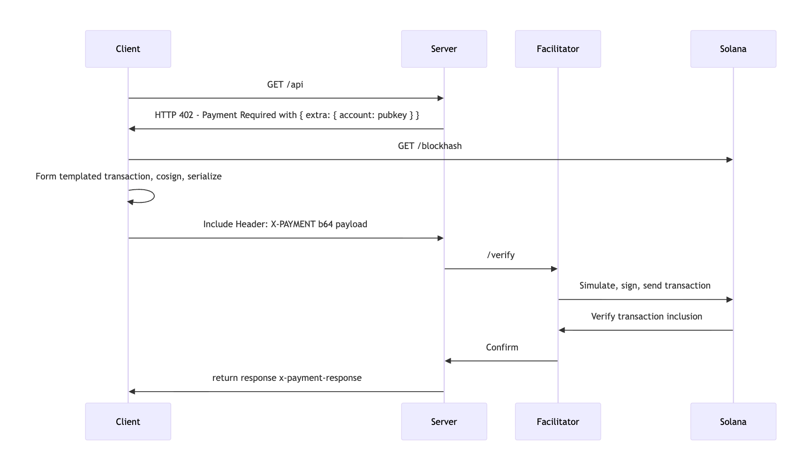

# X402 SDK for Solana

[中文 Readme](./README_zh.md)
A TypeScript SDK for Solana payment gateway based on the X402 protocol (implemented based on [x402](https://github.com/coinbase/x402)). Quickly integrate pay-per-use functionality into your application, supporting any Solana network and any SPL Token.

[](https://www.npmjs.com/package/x402-sdk-for-solana)
[](https://opensource.org/licenses/MIT)

## Table of Contents

- [X402 Introduction](#x402-introduction)
- [Integration](#integration)
- [Quick Start](#quick-start)
  - [Server Integration](#server-integration)
  - [Client Integration](#client-integration)
  - [Create Your Own Facilitator](#create-your-own-facilitator)
  - [Local Development and Testing](#local-development-and-testing)
- [API Documentation](#api-documentation)


## X402 Introduction

X402 Workflow:



1. **Client** sends a request to the Server
2. **Server** returns a 402 status code with payment requirements
3. **Client** creates and signs a payment transaction
4. **Client** attaches the signed transaction to the X-PAYMENT header and resends the request
5. **Server** verifies payment through the **Facilitator**
6. **Facilitator** submits the transaction to the **Solana** network
7. **Server** returns protected data


### Roles

- **Client**: User who initiates requests and pays fees
- **Server**: Service provider offering protected APIs
- **Facilitator**: Responsible for transaction verification and submission
- **Solana Network**: Blockchain network that records all transactions

## SDK Features

This SDK helps developers integrate Solana payments into their applications. It supports building your own Facilitator as well as server and client integration. Main features include:

- ✅ **Express Middleware**: Easy-to-use Express middleware to protect API endpoints with one line of code
- ✅ **Client Fetch Wrapper**: Fetch wrapper that automatically handles 402 payments
- ✅ **Facilitator Support**: Built-in payment verification and settlement services
- ✅ **Custom Token Support**: Supports any SPL Token
- ✅ **Multi-Network Support**: Supports solana-localnet, solana-devnet, and solana
- ✅ **TypeScript Support**: Complete type definitions

## Integration

### Project Configuration Requirements
Projects using **Node.js**: >= 18.0.0 should configure:

```json
{
  "type": "module"
}
```

To support **ES Module (ESM)**.


### Install SDK

Install the SDK using npm, yarn, or pnpm:

```bash
# Using npm
npm install x402-sdk-for-solana

# Using yarn
yarn add x402-sdk-for-solana

# Using pnpm
pnpm add x402-sdk-for-solana
```


## Quick Start

Choose the appropriate integration method based on your use case:

### Create Your Own Facilitator

Deploy your own Facilitator service to verify and settle payments:


#### Configure Environment Variables

```bash
# Create .env file (facilitator configuration)
SVM_PRIVATE_KEY=your_facilitator_private_key_as_fee_payer
SVM_NETWORK=solana-localnet
SVM_RPC_URL=http://127.0.0.1:8899
PORT=3002
```

| Variable | Description | Example |
|------|------|------|
| `SVM_PRIVATE_KEY` | Facilitator's private key (Base58 format) | `4FdeM2Hyx...` |
| `SVM_NETWORK` | Solana network | `solana-localnet` / `solana-devnet` / `solana` |
| `SVM_RPC_URL` | RPC node URL | `http://127.0.0.1:8899` |
| `PORT` | Facilitator service port | `3002` |


See [Local Development and Testing](#local-development-and-testing) for reference

#### Create Facilitator Service

Example Code:

```typescript
import express from "express";
import { verify, settle } from "x402-sdk-for-solana/facilitator";
import {
  PaymentRequirementsSchema,
  PaymentPayloadSchema,
  createSigner,
  SupportedSVMNetworks,
  type X402Config,
} from "x402-sdk-for-solana/types";

const app = express();
app.use(express.json());

const PRIVATE_KEY = process.env.SVM_PRIVATE_KEY!;
const NETWORK = process.env.SVM_NETWORK || "solana-devnet";
const RPC_URL = process.env.SVM_RPC_URL;

// Configuration
const x402Config: X402Config | undefined = RPC_URL
  ? { svmConfig: { rpcUrl: RPC_URL } }
  : undefined;

// Verification endpoint
app.post("/verify", async (req, res) => {
  try {
    const { paymentPayload, paymentRequirements } = req.body;

    const parsedRequirements = PaymentRequirementsSchema.parse(paymentRequirements);
    const parsedPayload = PaymentPayloadSchema.parse(paymentPayload);

    const signer = await createSigner(parsedRequirements.network, PRIVATE_KEY);
    const result = await verify(signer, parsedPayload, parsedRequirements, x402Config);

    res.json(result);
  } catch (error) {
    res.status(400).json({ error: "Invalid request" });
  }
});

// Settlement endpoint
app.post("/settle", async (req, res) => {
  try {
    const { paymentPayload, paymentRequirements } = req.body;

    const parsedRequirements = PaymentRequirementsSchema.parse(paymentRequirements);
    const parsedPayload = PaymentPayloadSchema.parse(paymentPayload);

    const signer = await createSigner(parsedRequirements.network, PRIVATE_KEY);
    const result = await settle(signer, parsedPayload, parsedRequirements, x402Config);

    res.json(result);
  } catch (error) {
    res.status(400).json({ error: "Invalid request" });
  }
});

// Supported payment types
app.get("/supported", async (req, res) => {
  const signer = await createSigner(NETWORK, PRIVATE_KEY);
  res.json({
    kinds: [{
      x402Version: 1,
      scheme: "exact",
      network: NETWORK,
    }]
  });
});

app.listen(3002, () => {
  console.log("Facilitator running on port 3002");
});
```

### Server Integration

Integrate the X402 SDK into your server application to enable access to server resources only after user payment.

#### Configure Server Environment Variables

```
FACILITATOR_URL=http://localhost:3002
NETWORK=solana-localnet
ADDRESS=your_server_address
TOKEN_MINT_ADDRESS=your_token_address
TOKEN_DECIMALS=6
TOKEN_NAME=USDC
```

| Variable | Description | Required |
|------|------|------|
| `FACILITATOR_URL` | Facilitator service address | ✅ |
| `NETWORK` | Payment network | ✅ |
| `ADDRESS` | Payment receiving address | ✅ |
| `TOKEN_MINT_ADDRESS` | Token Mint address | ⚠️ Optional |
| `TOKEN_DECIMALS` | Token decimal places | ⚠️ Optional |
| `TOKEN_NAME` | Token name | ⚠️ Optional |

> ⚠️ If Token-related variables are not configured, the default USDC defined in `lib/x402/types/shared/evm/config.ts` will be used.


See [Local Development and Testing](#local-development-and-testing) for reference


#### Create Express Server (Example)

```typescript
import express from "express";
import { paymentMiddleware } from "x402-sdk-for-solana";
import type { Resource, SolanaAddress, X402Config } from "x402-sdk-for-solana";

const app = express();

// Configure payment middleware
app.use(
  paymentMiddleware(
    "YOUR_SOLANA_ADDRESS" as SolanaAddress,  // Payment receiving address
    {
      "GET /weather": {
        price: "0.0018",  // Token amount required per request
        network: "solana-devnet"
      }
    },
    { url: "https://your-facilitator-url.com" }  // Facilitator service address
  )
);

// Define protected route
app.get("/weather", (req, res) => {
  res.json({
    temperature: 72,
    condition: "sunny",
    location: "San Francisco"
  });
});

app.listen(4021, () => {
  console.log("Server running on port 4021");
});
```

#### Using Custom Token

```typescript
const x402Config: X402Config = {
  svmConfig: {
    defaultToken: {
      address: "YOUR_TOKEN_MINT_ADDRESS",
      decimals: 6,
      name: "USDC",
    },
  },
};

app.use(
  paymentMiddleware(
    payTo,
    routes,
    { url: facilitatorUrl },
    undefined,  // paywall config
    x402Config  // Pass custom token configuration
  )
);
```

### Client Integration

Integrate the X402 SDK into your client application to automatically complete signatures when calling payment-required URLs.

#### Configure Client Environment Variables

```
SVM_NETWORK=solana-localnet
SVM_RPC_URL=http://127.0.0.1:8899
USER_SVM_PRIVATE_KEY=your_client_private_key
```

| Variable | Description | Example |
|------|------|------|
| `SVM_NETWORK` | Solana network | `solana-localnet` |
| `SVM_RPC_URL` | RPC node URL | `http://127.0.0.1:8899` |
| `USER_SVM_PRIVATE_KEY` | User private key (Base58 format) | `3E8kogunw...` |


#### Using the Fetch Wrapper

```typescript
import {
  wrapFetchWithPayment,
  createSigner,
  decodeXPaymentResponse
} from "x402-sdk-for-solana/fetch";

async function callProtectedAPI() {
  // Create signer
  const signer = await createSigner(
    "solana-devnet",  // Network
    "YOUR_PRIVATE_KEY_BASE58"  // Your private key
  );

  // Wrap fetch
  const fetchWithPayment = wrapFetchWithPayment(
    fetch,
    signer,
    undefined,
    undefined,
    {
      svmConfig: {
        rpcUrl: "https://api.devnet.solana.com"  // Custom RPC URL (optional)
      }
    }
  );

  // Use fetchWithPayment to make requests
  // The function detects 402 status code, parses payment requirements from the `x-payment-required` header
  // Creates and signs payment transaction, attaches payment info (x-payment header) and resends request
  const response = await fetchWithPayment("http://localhost:4021/weather", {
    method: "GET"
  });

  const data = await response.json();
  console.log("Response:", data);

  // Parse payment response
  const paymentResponse = decodeXPaymentResponse(
    response.headers.get("x-payment-response")!
  );
  console.log("Payment:", paymentResponse);
}

callProtectedAPI();
```


### Local Development and Testing

The examples directory contains a simple example for local testing.

#### Start Solana Localnet

Run in terminal:

```bash
solana-test-validator
```

Keep this terminal running and continue with the following steps in a new terminal.

#### Automated Account Setup Script [Optional]

```bash
pnpm setup-localnet
```

Script output example:

```
=== Setup Complete! ===

Environment Variables for .env:
SVM_PRIVATE_KEY=4FdeM2Hyx...
SVM_NETWORK=solana-localnet
SVM_RPC_URL=http://127.0.0.1:8899
PORT=3002

Environment Variables for .env_server:
FACILITATOR_URL=http://localhost:3002
NETWORK=solana-localnet
ADDRESS=67uA54AUE...
TOKEN_MINT_ADDRESS=AhV2C7iCk...
TOKEN_DECIMALS=6
TOKEN_NAME=USDC

Environment Variables for .env_client:
SVM_NETWORK=solana-localnet
SVM_RPC_URL=http://127.0.0.1:8899
USER_SVM_PRIVATE_KEY=3E8kogunw...
```


The automated setup script will:
- Generate 3 key pairs (facilitator, server, client)
- Airdrop SOL to all accounts
- Create custom SPL Token
- Create token accounts for all accounts and fund them
- Output configured environment variables

#### Start Local Test Services

Run in three different terminals:

**Terminal 1 - Facilitator:**
```bash
pnpm run 402_facilitator
```

**Terminal 2 - Server (API server):**
```bash
pnpm run 402_server
```

**Terminal 3 - Client (client test):**
```bash
pnpm run 402_client
```

If everything works correctly, you should see the client successfully request and pay for API call fees!


## API Documentation

### `paymentMiddleware(payTo, routes, facilitator?, paywall?, x402Config?)`

Create Express payment middleware to add X402 payment protection to specified routes.

#### Feature Overview

`paymentMiddleware` is an intelligent Express middleware that:

1. **Intercepts requests** - Checks if requests match protected routes, ensuring only paying users can access protected content
2. **Verifies payment** - Verifies user payment credentials through Facilitator
3. **Executes routes** - Executes actual business logic after verification
4. **Settles payment** - Submits payment to blockchain only after successful route execution
5. **Returns response** - Returns protected content to the user


#### Workflow

```
Request arrives
  ↓
Check if matches protected route
  ├─ No match → Pass through
  └─ Match ↓
Check X-PAYMENT header
  ├─ None → Return 402 + payment requirements
  │   ├─ Browser → HTML Paywall
  │   └─ API → JSON format
  └─ Present ↓
Verify payment
  ├─ Failed → Return 402 error
  └─ Success ↓
Execute protected route
  ↓
Check execution result
  ├─ Failed (statusCode >= 400) → Don't settle payment
  └─ Success ↓
Settle payment (submit to blockchain)
  ↓
Return protected content + X-PAYMENT-RESPONSE
```

#### Parameter Details

| Parameter | Type | Required | Description |
|------|------|------|------|
| `payTo` | `Address \| SolanaAddress` | ✅ | Payment receiving address |
| `routes` | `RoutesConfig` | ✅ | Route configuration object defining which routes require payment and pricing |
| `facilitator` | `FacilitatorConfig` | ⚠️ | Facilitator service configuration for payment verification and settlement |
| `paywall` | `PaywallConfig` | ⚠️ | Paywall configuration for customizing payment page shown to browser users |
| `x402Config` | `X402Config` | ⚠️ | X402 custom configuration, such as custom RPC URL and Token |

#### Type Definitions

##### RoutesConfig

```typescript
type RoutesConfig = {
  [route: string]: {
    price: string | number;  // USD price (e.g., "0.01") or atomic units (e.g., 10000)
    network: Network;        // Payment network: 'solana-localnet' | 'solana-devnet' | 'solana'
    config?: {
      description?: string;        // Endpoint description
      mimeType?: string;           // Response MIME type
      maxTimeoutSeconds?: number;  // Maximum timeout (default 60 seconds)
      discoverable?: boolean;      // Whether discoverable (default true)
      customPaywallHtml?: string;  // Custom Paywall HTML
    };
  };
};
```

**Supported Route Patterns:**
- `"GET /weather"` - Exact match
- `"POST /api/*"` - Wildcard match
- `"/premium/*"` - Match all HTTP methods

##### FacilitatorConfig

```typescript
type FacilitatorConfig = {
  url: string;  // Facilitator service address
  createAuthHeaders?: () => Promise<{
    verify?: Record<string, string>;   // Authentication headers for verify endpoint
    settle?: Record<string, string>;   // Authentication headers for settle endpoint
  }>;
};
```

##### PaywallConfig

```typescript
type PaywallConfig = {
  cdpClientKey?: string;         // Coinbase Developer Platform API key
  appName?: string;              // Application name displayed in wallet connection interface
  appLogo?: string;              // Application logo URL
  sessionTokenEndpoint?: string; // Session token endpoint (for Onramp)
};
```

**Note:** Paywall configuration only takes effect when browser users access, used to customize payment page branding and experience.

##### X402Config

```typescript
interface X402Config {
  svmConfig?: {
    rpcUrl?: string;  // Custom Solana RPC URL
    defaultToken?: {
      address: string;   // Token Mint address
      decimals: number;  // Token decimal places
      name: string;      // Token name
    };
  };
}
```

#### Usage Examples

**Basic Usage:**

```typescript
import express from "express";
import { paymentMiddleware } from "x402-sdk-for-solana";

const app = express();

app.use(
  paymentMiddleware(
    "YOUR_SOLANA_ADDRESS",
    {
      "GET /weather": {
        price: 0.01,  // $0.01 USDC
        network: "solana-devnet"
      }
    },
    { url: "http://localhost:3002" }
  )
);

app.get("/weather", (req, res) => {
  res.json({ temp: 72, condition: "sunny" });
});

app.listen(4021);
```

**Advanced Usage:**

```typescript
app.use(
  paymentMiddleware(
    "YOUR_SOLANA_ADDRESS",
    {
      // Different prices for different routes
      "GET /weather": {
        price: 0.01,
        network: "solana-devnet",
        config: {
          description: "Real-time weather data",
          maxTimeoutSeconds: 120
        }
      },
      "POST /premium/*": {
        price: 0.1,
        network: "solana-devnet",
        config: {
          description: "Premium API service"
        }
      }
    },
    // Facilitator configuration
    {
      url: "https://your-facilitator.com",
      createAuthHeaders: async () => ({
        verify: { "Authorization": "Bearer token" },
        settle: { "Authorization": "Bearer token" }
      })
    },
    // Paywall configuration
    {
      appName: "My Weather API",
      appLogo: "/logo.png",
      cdpClientKey: "your-cdp-key"
    },
    // X402 configuration
    {
      svmConfig: {
        rpcUrl: "http://localhost:8899",
        defaultToken: {
          address: "YOUR_TOKEN_MINT",
          decimals: 6,
          name: "USDC"
        }
      }
    }
  )
);
```


---

### Client API `wrapFetchWithPayment(fetch, walletClient, maxValue?, paymentRequirementsSelector?, config?)`

Create a fetch wrapper that supports X402 automatic payment.

#### Feature Overview

`wrapFetchWithPayment` wraps the standard `fetch` API into a "payment-aware" version that:

1. **Sends initial request** - Sends request like normal fetch
2. **Detects 402 response** - Automatically identifies payment-required endpoints
3. **Parses payment requirements** - Extracts payment information from response
4. **Verifies amount** - Checks if payment amount is within allowed range, maxValue prevents unexpected large payments
5. **Creates and signs payment** - Automatically creates payment transaction using provided wallet
6. **Resends request** - Resends request with attached payment credentials
7. **Returns content** - Returns protected content

#### Workflow

```
fetchWithPayment(url)
  ↓
Send initial request
  ↓
Receive response
  ├─ 200 → Return directly
  └─ 402 → Payment required ↓
Parse payment requirements
  ↓
Select payment method (paymentRequirementsSelector)
  ↓
Verify amount <= maxValue
  ├─ Exceeded → Throw error
  └─ Pass ↓
Create and sign payment transaction
  ↓
Attach X-PAYMENT header and resend request
  ↓
Return protected content
```

#### Parameter Details

| Parameter | Type | Required | Description |
|------|------|------|------|
| `fetch` | `typeof globalThis.fetch` | ✅ | Fetch function to wrap (usually `globalThis.fetch`) |
| `walletClient` | `Signer \| MultiNetworkSigner` | ✅ | Wallet client for signing payments |
| `maxValue` | `bigint` | ⚠️ | Maximum allowed automatic payment amount (atomic units), defaults to 0.1 USDC |
| `paymentRequirementsSelector` | `PaymentRequirementsSelector` | ⚠️ | Custom payment method selector |
| `config` | `X402Config` | ⚠️ | X402 configuration (e.g., custom RPC URL) |

#### Type Definitions

##### PaymentRequirementsSelector

```typescript
type PaymentRequirementsSelector = (
  paymentRequirements: PaymentRequirements[],  // All available payment options
  network?: Network | Network[],                // Networks supported by client
  scheme?: "exact"                              // Payment scheme
) => PaymentRequirements;                       // Returns selected payment method
```

**Default Selection Strategy:**
1. Prioritize Base network (lower fees)
2. Filter options matching client network
3. Prioritize USDC Token
4. If none match, select first option

#### Usage Examples

**Basic Usage:**

```typescript
import {
  wrapFetchWithPayment,
  createSigner
} from "x402-sdk-for-solana/fetch";

async function fetchProtectedAPI() {
  // Create signer
  const signer = await createSigner(
    "solana-devnet",
    "YOUR_PRIVATE_KEY_BASE58"
  );

  // Wrap fetch
  const fetchWithPayment = wrapFetchWithPayment(fetch, signer);

  // Use exactly like normal fetch
  const response = await fetchWithPayment("http://localhost:4021/weather");
  const data = await response.json();

  console.log("Weather:", data);
}
```

**Custom Maximum Payment Amount:**

```typescript
// Allow maximum payment of 1 USDC
const fetchWithPayment = wrapFetchWithPayment(
  fetch,
  signer,
  BigInt(1 * 10 ** 6)  // 1 USDC = 1,000,000 smallest units
);
```

**Custom Payment Selector:**

```typescript
// Always select cheapest payment method
const cheapestSelector = (requirements: PaymentRequirements[]) => {
  return requirements.reduce((cheapest, current) =>
    BigInt(current.maxAmountRequired) < BigInt(cheapest.maxAmountRequired)
      ? current
      : cheapest
  );
};

const fetchWithPayment = wrapFetchWithPayment(
  fetch,
  signer,
  BigInt(1 * 10 ** 6),
  cheapestSelector  // Use custom selector
);
```

**Custom RPC URL:**

```typescript
const fetchWithPayment = wrapFetchWithPayment(
  fetch,
  signer,
  undefined,  // Use default maxValue
  undefined,  // Use default selector
  {
    svmConfig: {
      rpcUrl: "http://localhost:8899"  // Custom RPC URL
    }
  }
);
```

**Complete Example:**

```typescript
import {
  wrapFetchWithPayment,
  createSigner,
  decodeXPaymentResponse
} from "x402-sdk-for-solana/fetch";

async function main() {
  const signer = await createSigner("solana-devnet", process.env.PRIVATE_KEY!);

  const fetchWithPayment = wrapFetchWithPayment(
    fetch,
    signer,
    BigInt(10 * 10 ** 6),  // Maximum payment of 10 USDC
    undefined,
    {
      svmConfig: {
        rpcUrl: "https://api.devnet.solana.com"
      }
    }
  );

  try {
    const response = await fetchWithPayment("http://localhost:4021/weather", {
      method: "GET"
    });

    const data = await response.json();
    console.log("Data:", data);

    // Parse payment response
    const paymentResponse = decodeXPaymentResponse(
      response.headers.get("x-payment-response")!
    );
    console.log("Payment:", paymentResponse);

  } catch (error) {
    if (error.message === "Payment amount exceeds maximum allowed") {
      console.error("Payment amount exceeds limit!");
    } else {
      console.error("Request failed:", error);
    }
  }
}
```

#### maxValue Details

`maxValue` is an important security parameter to prevent unexpected large payments:


**Amount Calculation Examples:**
- USDC has 6 decimal places
- 1 USDC = 1,000,000 smallest units
- 0.1 USDC = 100,000 smallest units
- Formula: `BigInt(amount * 10 ** decimals)`


### Reference Examples and NPM Scripts

```bash
# Automated setup for localnet environment variables
pnpm setup-localnet
```

Run in the examples directory:

```
# Start facilitator
pnpm run 402_facilitator

# Start server
pnpm run 402_server

# Run client
pnpm run 402_client
```


## Contributing

Contributions are welcome! Please refer to the [Contributing](./Contribute.md) section for detailed development guidelines.

## License

MIT

## Related Links

- [npm package](https://www.npmjs.com/package/x402-sdk-for-solana)
- [GitHub Repository](https://github.com/xilibi2003/x402-sdk-for-solana)
- [Solana Documentation](https://docs.solana.com/)
- [SPL Token Documentation](https://spl.solana.com/token)
- [Express Documentation](https://expressjs.com/)
- [SDK Publishing Guide](./SDK_PUBLISHING_GUIDE.md)

## Support

For questions or suggestions, please summit [Issues](https://github.com/xilibi2003/x402-sdk-for-solana/issues)

